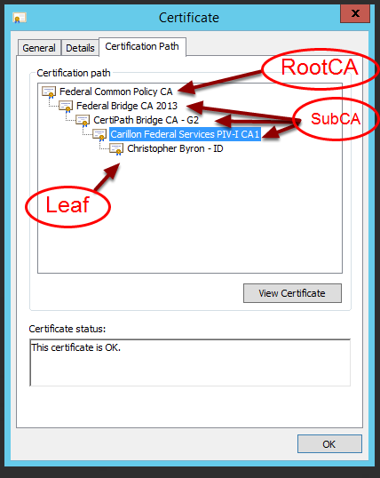
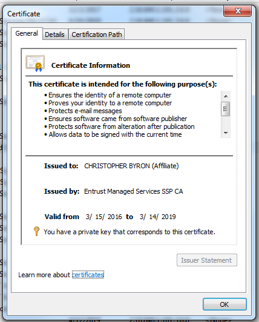
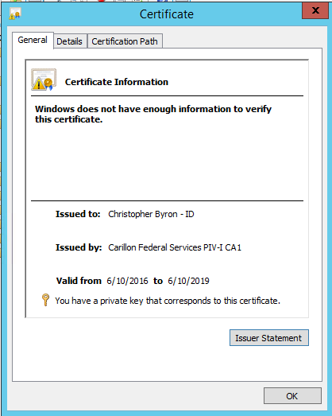

##A Solution for Office 365 Certificate-Based Authentication Via ADFS
<!--- The code below creates a difficulty identifier on the page, which can either 
be Beginner, Moderate, or Advanced depending on the technical knowledge required to 
complete the procedure. The example below includes text that mark the document as 
'Advanced', this string can be changed as needed.-->
<div style="float:right; padding:10px; margin-right:20px; border-radius:10px; width:180px; 
height:40px; box-shadow:3px 3px 5px 0px; text-align:center; background-color:#CCC; color:#666666">
<div style="color:#000000">
<em>Difficulty: Advanced</em>
</div>
</div>
Note: This document does not cover ADFS proxy server scenario, Office 365 account setup, or multiple domains in a Windows forest.  This playbook assumes advanceRFontana@ASOZ5L knowledge of Active Directory, Group Policy, PKI, and ADFS.
###Prerequisites
* Have a public-facing domain with the ability to manage entries.  
* Create publicly available (A/AAAA) records for the ADFS server. The FQDN of the DNS A/AAAA record must match the DNS name in the certificate.
* Acquire from a public Certificate Authority a certificate with a DNS name which matches the DNS name you have registered in DNS (adfs.foobar.com).  

###Install Active Directory server

####Active Directory/Domain preparations
1. If the user account has a non-routable domain suffix in the UPN, then add an alternate suffix if necessary in AD _Domains and Trusts_ for the alternate UPN.  
1. We recommend you have an OU filter plan before synchronizing to the cloud. In this document we will be creating an OU named O365 using PowerShell for easy OU filtering and sync to the cloud. Then we move users into O365 OU for clean synchronization to the cloud.  

####Active Directory Certificate Name Mapping Operation
A user presents a certificate to ADFS as part of authentication, and ADFS looks at the name mappings in AD to determine which user account should be logged on. If the certificate has a user principal name (UPN) the UPN is used to resolve the user account in AD. If there is no UPN, then the certificate's Distinguished Name is used.  

1. [Map a Certificate to a User Account](https://technet.microsoft.com/en-us/library/cc754866\(v=ws.11\).aspx).  

1. Perform the following operations while logged on as an Enterprise Administrator:  
    * Open MMC and add the _Certificates_ snap-in for the _Local User_, and select _Personal->Certificates_  
    * Find the user ID certificate, right click _All tasks->Export_. This opens the _Certificate Export_ Wizard  
    * Select _Next_ three times  
    * Browse to a folder, enter a unique file name, and select _Finish_  
    * Using Windows Explorer, navigate to the folder location of the saved certificate.  
    * Open the saved certificate, click on the _Certification Path_ tab, highlight the next certificate up from the user certificate, and click _View Certificate_.  
    * On that certificate select the _Details_ tab and click _Copy to File_ which opens the _Certificate Export Wizard_.  
    * Complete the wizard for that certificate and each certificate above it until all of the certificates in the path have been saved as _unique file names_.  

    | | |
    |---|---|
    ||The first Sub CA above the leaf is the _leaf issuer_.|
    |||
    |Valid trust path|Invalid trust path|
    
    Note: If the user certificate does not have a valid certificate path then stop and fix the trust path before continuing. 

###AD PKI Setup on the domain controller
1. Add the user's PIV auth cert (Leaf) into name mapping for the user in O365 OU in AD

1. Logged in as Enterprise Administrator, run the following from an elevated command 
prompt, where `certfile1..9` is the name of one of the exported certificate files.  
    ```bat
    certutil -f -dspublish certfile1.cer rootca  
    certutil -f -dspublish certfile2.cer subca
    certutil -f -dspublish certfile3.cer subca
    certutil -f -dspublish certfile4.cer subca
    certutil -f -dspublish certfile4.cer NTAuthca  
    ```
####Explanation
    
    * Publish the _RootCA_ certificate to `rootca`.  
    * Publish each _SubCA_ certificate below the _RootCA_ certificate to `subca`.  
    * Publish the Leaf's issuer certificate to both `subca` _and_ `NTAuthca`.  


1. Run the following PowerShell commands on the domain controller: 

    ```powershell
    #Create OU O365 in Active Directory Users and Computers
    New-ADOrganizationalUnit -Name O365 -Path "DC=Foobar,DC=COM"
    #Create an OU in Active Directory Users and Computers
    New-ADOrganizationalUnit -Name ADFS -Path "DC=Foobar,DC=COM"
    #Create KDS root key
    Add-KdsRootKey -EffectiveTime ((get-date).addhours(-10))
    #Create group managed service account
    New-ADServiceAccount gMSAcct01 -DNSHostName yourhost.Foobar.com
    #Create a group policy for ADFS OU and link to ADFS OU
    New-gpo -name ADFS_GPO | new-gplink -target "ou=ADFS,DC=Foobar,DC=COM"  
    ```  

####Group Policy setup
1. Edit the group policy you just added, _ADFS_GPO_.
1. Disable third party roots:  
    * Navigate to _Computer Configuration_->_Policies_->_Windows Settings_->_Security Settings_->_Public key policies_.  
    * Open the _Certifcate Path Validation Settings_ object.  
    * Check the _Define these policy settings_ checkbox.  
    * Select the _only Enterprise Root CAs_ radio button
1. Set _SendTrustedIssuerList_  
    * Within _Group Policy_, navigate to _Computer Configuration->Preferences->Windows Setting->Registry_  
    * Right-click and select _New->Registry Item_  
    * Create the item below:  
       i. Action:     Update  
      ii. Hive:       HKLM  
     iii. Path:       SYSTEM\CurrentControlSet\Control\SecurityProviders\SCHANNEL  
      iv. Value Name: SendTrustedIssuerList  
       v. Value type: REG_DWORD  
      vi. Value Data: 0x00000000 (0) Hex  
      
###Install ADFS server
####Prerequisites:
The system where ADFS is installed must be domain-joined.
The internal name for the ADFS server _must not_ match the external name on the 
certificate as in these examples:  
    `adfs.foobar.local` and `adfs.foobar.com`  
    `fs.foobar.com` and `adfs.foobar.com`  

Plan the number of ADFS servers according to the Microsoft Azure article, 
[Plan your AD FS deployment](https://msdn.microsoft.com/en-us/library/azure/dn151324.aspx).  
 
Download and install on the system running ADFS in the order below. :  

1. [Microsoft Online Services Sign-In Assistant for IT Professionals](https://www.microsoft.com/en-us/download/details.aspx?id=41950) (restart required).  
1. [Windows Azure Active Directory Module for Windows PowerShell](http://go.microsoft.com/fwlink/p/?linkid=236297) (for running a PowerShell script).

####Federation to Office365
1. Run these commands on the ADFS system using _Windows Azure Active Directory 
Module for Windows PowerShell_.  
    ```dos
    Azure Active Directory PowerShell  
    ```

    ```powershell
    $credential = Get-Credential  
    Import-Module MsOnline  
    Connect-MsolService -Credential $credential  
    #This will add the domain to Office365
    New-MSOLFederatedDomain -DomainName foobar.com  
    #If domain already exists in Office 365, then comment (#) the previous line and uncomment the following:
    #Update-MSOLFederatedDomain -DomainName foobar.com
    Get-msoldomain
    #This should show the domain is Federated with Office 365
    ```
1. Open _ADFS Management_ and set authentication method to only certificate 
authentication under _Authentication Policies_.  

####AD Synchronization to Office 365 Cloud
1. To configure and start synchronization from the on-premise AD to the O365 cloud, 
you'll need to consider the size of your organization and directories.
    * For large organization or large directories, download and install 
    [Azure AD Connect for Synchronization](http://go.microsoft.com/fwlink/?LinkId=615771) on a member server in the domain.   
    * For small organizations or small directories, download and install 
    [Azure AD Connect for Synchronization](http://go.microsoft.com/fwlink/?LinkId=615771) on the domain controller.  

####Firewall
1. Configure firewall to Allow Inbound to ADFS TCP 443 & 49443.  

####Group policy enforcement updates
1. Move all ADFS servers into ADFS OU in _Active Directory Users and Computers_.  
1. From an Administrator command prompt, run `gpupdate /force` on the ADFS server.