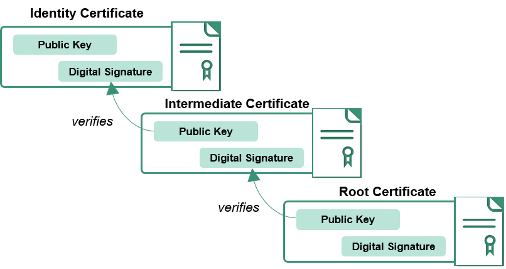
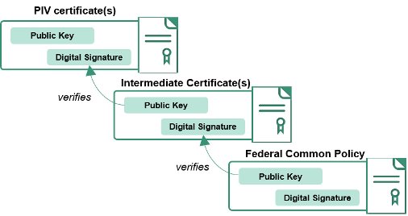
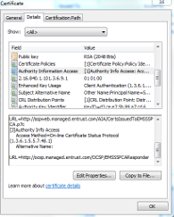
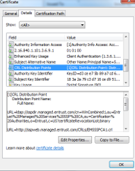

<div style="float:right; padding:10px; margin-right:20px; border-radius:10px; width:180px; height:40px; box-shadow:3px 3px 5px 0px; text-align:center; background-color:#CCC; color:#666666">
<div style="color:#000000">
<em>Advanced</em>
</div>
</div>

One of the most common questions is "What are all these certificates and how do I configure my applications to use them?".  Answering this question involves explaining three principles:

1.  [Trust](#trust)
2.  [Certificate *chains*](#certificate-chains)
   * [Download root and intermediate certificates](#download-root-and-intermediate-certificates)
3.  [Revocation](#revocation)

#### Trust
Identity certificates are issued and digitally signed by a _Certificate Authority_.  The _Certificate Authority_ that signed your PIV certificates is called an _**Intermediate** Certificate Authority_ because it was issued a certificate by another _Certificate Authority_.  This process of issuing and signing continues until there is one  _Certificate Authority_ that is called the _**Root** Certificate Authority_.

The full process of proving identity when issuing the certificates, auditing the certificate authorities, and the cryptographic protections of the digital signatures establish the basis of Trust for PIV credentials and certificates.

{:style="float:center"}

For the US Federal Government, there is one Root Certificate Authority named _Federal Common Policy Certificate Authority (COMMON)_, and dozens of Intermediate Certificate Authorities.  The US Federal Government has also established Trust with other Certificate Authorities which serve specific business and international government communities.

*  [A graph of the federal public key infrastructure, including the business communities](http://fpki-graph.fpki-lab.gov/)

The participating Certificate Authorities and the policies, processes, and auditing is referred to as the [*Federal Public Key Infrastructure (FPKI)*](https://www.idmanagement.gov/IDM/s/article_content_old?tag=a0Gt0000000SfwP).

#### Certificate Chains
To digitally trust YOU and your PIV credential certificates, the workstations, servers, applications and network domains will be configured. Understanding and managing certificate chains are one of the methods to configure trust.

The certificate chain includes the Intermediate Certificate Authorities certificates and the Federal Common Policy Certificate Authority (COMMON) root certificate.

{:style="float:center"}

The Federal Common Policy Certificate Authority (COMMON) root certificate is included in Microsoft, Adobe and some Apple trust stores by default.  It is not included by default in Mozilla, java, _all_ mobile devices, or linux operating systems.  Therefore, if you are an engineer or developer working on supporting PIV authentication, you may need to download and install the root certificate (COMMON) for your workstations, servers, applications and network domains.

Many applications may require Intermediate Certificates to successfully trust ALL PIV credentials, and may not support the automatic retrieval of certificate chains.  You should consider the possible unintended consequences of installing intermediate certificates which _only_ represent intermediate certificate chains for your agency users.  It is increasingly more common for users from other agencies or partners to _authenticate_ to your networks or applications, and this usage is the foundation of PIV to promote trust, interoperability, secure authentication, and efficiency across the US Federal Government.  You may want to be able to Trust all PIV credentials from agencies, and credentials from our trusted partners.

General recommendations for trust and certificate chain management include:

* COMMON should always be used as the root certificate authority
* Management of root and intermediate certificate authority certificates and distribution to network domains, workstations, servers and applications should be managed with group policy objects, secure automated distributions mechanisms, and enterprise policies and procedures to ensure updates are managed effectively.
* NIST published an [Information Technology Laboratory (ITL) bulletin](http://csrc.nist.gov/publications/nistbul/july-2012_itl-bulletin.pdf) in July 2012 which includes general practices to consider.

Installation of the root certificate and intermediate certificates is dependent upon operating systems and applications. First you need to know where to download the certificates.

#### Download root and intermediate certificates

Download Federal Common Policy Certificate Authority (COMMON) root certificate

1. [COMMON can be downloaded here](http://http.fpki.gov/fcpca/fcpca.crt)
  * cn=Federal Common Policy CA, ou=FPKI, o=U.S. Government, c=US
  * SHA1 Hash: 90 5f 94 2f d9 f2 8f 67 9b 37 81 80 fd 4f 84 63 47 f6 45 c1


Download any additional Intermediate Certificate Authority certificates

1. Contact your agency's information security teams for help on additional intermediate certificates, or
1. View your PIV Authentication certificate
  * To review how to view your PIV Authentication certificate go to the [Details of a PIV Credential](../details)
1. In the **Authority Information Access (AIA)** extension, there is a URL (http://) which references a file with a .p7b or .p7c extension
1. Download the file, open it, and view the intermediate certificate authority certificates
1. Repeat the process using the AIA extension of the intermediate certificate authority certificates until the final reference finds an intermediate certificate authority certificate that is issued and signed by COMMON

<!--TODO: openssl and certutil scripts to automate the retrieval and aia chases; simple versions -->


#### Revocation
Revocation is the process and technology to identify a certificate as no longer valid - to tell computers and applications _"do not trust this certificate anymore"_.

PIV credential certificates will be _revoked_ when a user terminates employment or a contract with an agency, is issued a new credential, is issued an updated PIV credential, or has a lost, stolen or damaged PIV credential.  The revocation of PIV credential certificates occurs with the PIV credential issuer and certificate authority.

There are two methods available to verify if a PIV credential certificate has been revoked:

1. Online Certificate Status Protocol (OCSP)
2. Certificate Revocation Lists (CRLs)

The table below outlines general information on each method, the certificate extension which contains the reference, the protocols, and design considerations.

| Type | Certificate Extension | Protocol (Port) | Considerations|
| ----- | -------| -------| ------|
| OCSP | Authority Information Access | HTTP (80) | All PIV certificates have OCSP references and OCSP responder web services which are internet accessible and provided by the issuing certificate authority. Intermediate certificate authorities are **not** required to have OCSP available for the _intermediate_ certificates.|
| CRL  | CRL Distribution Point (CDP) | HTTP (80) | All PIV certificates have CRL references and CRLs files published to internet accessible web services by the issuing certificate authority.  All intermediate certificate authority certificates also have CRL references, files and internet accessible web services.  CRL files have an expiration time which varies between 6 hours to 18 hours. CRL file sizes distributed by issuing certificate authorities as of the date of this guide range from a few kilobytes to **over 30 megabytes (MB)**.


<!-- TODO: Graphical

{:style="float:center"}


{:style="float:center"} -->


<!-- TODO: Certutil   -->


<!-- TODO: OpenSSL

``` openssl x509 -in mypiv.crt -noout -ocsp_uri

``` -->
