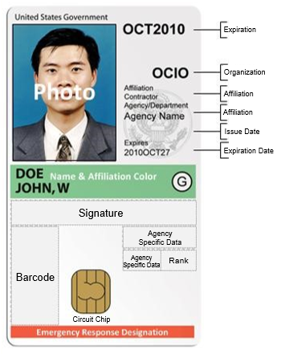

Many of the design features and data elements on the PIV card enable enhanced security and privacy when used to verify a claimed identity. The features of the PIV card can be broken out into two main categories: physical elements and logical elements.

#### Physical Elements

{:style="float:right"}

An example of a PIV card can be seen to the right. This image depicts the standard placing for physical card components such as photograph, name, affiliation, expiration date, organization, and the circuit chip to name a few. Physical elements that are not shown include a magnetic stripe and serial number. PIV cards also contain at least one security feature that aids in reducing counterfeiting, is resistant to tampering, and provides visual evidence of tampering attempts, such as optical varying structures or inks, laser etching, holographic images, and watermarks.

#### Logical Elements

Most applications that use PIV cards leverage the logical data elements on the card to perform verification of a claimed identity. These data elements are defined in <a href="http://nvlpubs.nist.gov/nistpubs/SpecialPublications/NIST.SP.800-73-4.pdf">NIST SP 800-73</a>. The information on a PIV card allows an agency to select appropriate levels of security for applications being accessed. 

The following logical elements authenticate the PIV card:

* **Cardholder Unique Identifier (CHUID)**, which is a digitally signed Federal Agency Smart Card Number (FASC-N) plus other elements that can be used to verify that the PIV card was issued by an authorized entity.
* **Card Authentication** can be used to verify that the PIV card was issued by an authorized entity, has not expired, and has not been revoked.

The following logical elements authenticate the user:

* **Photograph**, which is stored and signed digitally and allows a human to confirm that the printed photo on the card has not been altered.
* **Biometric Identity Information** such as fingerprints or iris, which can be used to verify the identity of the PIV card holder.
* **PIV Authentication** can be used to verify that the PIV card was issued by an authorized entity, has not expired, has not been revoked, and to verify that the holder of the card is the same individual it was issued to.

The following logical elements are user-oriented capabilities:

* **Digital Signature** allows the cardholder to digitally sign a document or email, providing both integrity and non-repudiation.
* **Digital Encryption** allows the cardholder to work with digitally encrypted documents or email, providing confidentiality through ensuring that only authorized parties con read the document. This includes a key history containing past encryption keys. 

Card and PIV authentication, digital signatures, and digital encryption all leverage private key, public key, and certificate technologies.
