# Locally Trusted OCSP Configuration

#### Table of Contents
#### [Introduction](#introduction-1)
#### [Security Risks](#security-risks-1)
#### [Prerequisites](#prerequisites-1)
#### [Install Microsoft OCSP Responder](#install-microsoft-ocsp-responder-1)
#### [Windows Client Configuration](#windows-client-configuration-1)
#### [End-to-End Testing](#end-to-end-testing-1)

----------

## Overview <!-- LaChelle's template.md in various locations suggestions that "Overview" should be 1st section.  This intro. conforms well to "Overview," so recommend using that title. -->

Within the **Public Key Infrastructure (PKI)**, the **Online Certificate Status Protocol (OCSP)** is used to determine the status of a public key certificate (RFC 2560, FIPS 201-2). An OCSP Responder can functionally replace **Certificate Revocation Lists (CRLs)**, which are "list[s] of revoked public key certificates created and digitally signed by a **Certification Authority**" **(CA)** (FIPS 201-2, NIST SP 800-63, CNSSI 4009) (i.e., the issuer that certified it in the first place). A response from an OCSP Responder, as with a CRL, will tell you whether a public key certificate has been revoked by its CA. If your organization relies on Internet-hosted sources for your local network's critical functionality, including the ability to verify certificate statuses, you could use an OCSP Responder, instead of CRLs. In this case, your locally trusted OCSP Responder (service) would create a locally hosted, trusted copy of revoked certificate information<!-- Where does the OCSP copy the info from? -->. Hosting a local OCSP Responder can ensure that Clients (applications and devices) do not experience the Internet disruptions that can occur with either remotely hosted CRLs or OCSP.

If a locally trusted OCSP Responder is deployed, even mobile clients such as laptops, tablets, and phones could potentially use it  remotely<!--Could potentially?--> (i.e., if your organization configures the OCSP Responder to be exposed to the Internet). Clients should always be configured to "fail-over" to a backup<!-- Backup vs. "next" is more clear. --> source for obtaining certificate-revocation statuses in the event of an Internet disruption. A locally trusted OCSP Responder could be that backup source&mdash;providing additional resiliency for users who are working on a local network or connected remotely. If considering this service, we highly recommended increasing its security by choosing a server name associated with an Internet Protocol (IP) address, as discussed in the **_Install Microsoft Windows Server 2012 R2 as an OCSP Responder_** section.

> <i class="icon-info"></i>  <!-- This is pretty long for an Info call-out box. -->**Transparent Caching Proxy&mdash;an Alternative Backup (Fail-over) Method.** The **Transparent Caching Proxy** is a highly effective method of obtaining and providing CRLs during Internet, CRL, or OCSP service disruptions and could preclude the need for a locally trusted OCSP. This proxy can also greatly reduce Internet connection-bandwidth consumption. To use a Transparent Caching Proxy, configure it to frequently check the end-point for modified <!--Explain file types.-->**.p7c** and **.crl** files so that the cache maintains the most up-to-date information. Additionally, you can configure a script on any host "behind" the transparent cache to regularly download chosen CRLs. This will keep the cache "fresh" even when users on the local network are not downloading CRLs during off-peak (i.e., non-working) hours.<!-- Don't understand the point about downloading CRLs during off-peak hours effect freshness of cache (unclear)? --> To learn more about how to configure a Transparent Caching Proxy, see _(insert link to relevant document here)_.<!--Recommend putting a link to a procedure here, rather than making folks go search for a website, document, etc.-->

## Assumptions

To effectively use these OCSP Responder procedures, we recommend that you possess the following: <!-- Since this guide requires a technical user, where the "assume no prior knowledge" is not appropriate, we might add Assumptions about the user's level of expertise in relevant areas. I took a guess at these.  In LaChelle's template.md for some repos includes a section in this position called "Assumptions," recommend we use that here.  This may not be appropriate. Just a thought.-->:

  * System administrator (SA) or network administrator privileges/permissions 
  * Experience with network configurations  
  * Experience with installing and configuring servers
  * Experience with certificate issuance and revocation practices
  * Experience with CAs
  * Experience using CPs and CPSs

## Security risks

<!--I had some trouble following this discussion.-->By operating a locally trusted OCSP Responder, your organization is assuming all of the security risks introduced when you do not depend directly on the authoritative revocation status sources (i.e., CAs). <!--Are the sources = the CAs & they are normally consulted for accurate CRLs (unclear)? Does the OCSP Responder extract the CRL information from the CA and so is not a "direct" (more secure) means? -->CAs follow stringent <!-- Are the policies and procedures the CP and CPS mentioned in next sentence (unclear)? Explain "multi-person control" for reader. -->requirements for multi-person control, physical security<!-- How does physical security relate to CRLs? -->, and hardware cryptographic modules <!-- Hardare mentioned here but not software (which is mentioned below). -->, which are detailed in each CA's Certificate Policy (CP) and Certification Practices Statement (CPS).  If you do not implement equivalent security controls to those implemented by a CA (i.e., as stated in a CP and CPS), then your local OCSP Responder becomes the weak link in the chain, and your organization's overall <!-- ? -->network-security assurance level would effectively be reduced to that of your local network configuration. For example, if your organization validates Personal Identity Validation (PIV) authentication certificates (hardware)<!-- "Hardware certificates" relate to a PIV card used for computer access to a network? -->, but you are using software cryptographic keys on your local OCSP Responder, then the validated PIV certificates' assurance level may be associated with software rather than hardware, both of which have different CP and CPS requirements. <!-- Is this what you meant? -->This may or may not be acceptable, depending on the use case. 

Some other security best practices to consider when implementing an OCSP Responder: 

  * No clients (applications and devices) should ever trust a locally trusted OCSP Responder unless they have been explicitly configured to do so. <!--How would a client trust the OCSP Responder without being configured to do so? -->
  
  * The CA you use must be private to your organization. 
  
  * The CA and issued OCSP Responder certificates should not be trusted outside of your intended pool of clients for any purposes. 
  
  * A common misunderstanding is viewing an OCSP check is the same thing as certificate validation--this is a _dangerous and completely inaccurate assumption_. The proper procedures for certificate path validation can be found in section 6 of [RFC 5280](https://www.ietf.org/rfc/rfc5280.txt), _Internet X.509 Public Key Infrastructure Certificate and Certificate Revocation List Profile_.

These are examples of an agency's or organization's local risk decisions that must be carefully considered. Security best practices and sound risk decisions should always shape a deployment design for an OSCP Responder.

## Before you begin

Before you begin, we recommend that you review the OCSP document series available from Microsoft TechNet:  [Implementing an OCSP Responder](https://blogs.technet.microsoft.com/askds/2009/06/24/implementing-an-ocsp-responder-part-i-introducing-ocsp/). Microsoft's document series includes supporting information that has been omitted from this OSCP guide.

### Prerequisites

#### Required:

  * A locally trusted Root CA to issue OCSP Responder certificates
  * Microsoft Windows 2012 R2 server

> In a hierarchical PKI, a Root CA's public key serves as the most trusted (i.e., the beginning of trust paths) for a security domain (NIST SP 800-32, CNSSI-4009). We recommend that you create <!-- create? -->a new, dedicated **Root CA** to issue locally trusted, OCSP Responder certificates. The Root CA will be used only for an OCSP Responder in a local-network to obtain certificate-revocation statuses, which significantly reduces the potential security risks associated with using a Root CA. <!-- Is this what you meant?  Not plain language; wasn't clear. --> 

(The procedures below provide additional steps for installing and configuring this Root CA.<!-- Which procedures specifically? --> For additional information, see [Appendix 2 - Using Microsoft CA as the self signed root](#Appendix-2---Using-Microsoft-CA-as-the-self-signed-root-1).)

#### Recommended: 

  * Hardware Security Module (HSM)
  * CP and CPS:  Documented security policies and procedures for deploying and operating the certificate-issuing Root CA and OCSP Responder(s). 

> <i class="icon-info"></i>  <!-- Question: Do you mean for installing CAs other than the Root CA?  I thought we do include procedures about that below..? -->This guide does not provide detailed procedures for installing CAs or configuring HSMs (i.e., numerous online resources provide CA installation procedures, and HSM vendors provide configuration procedures). Additionally, this guide does not provide instructions for creating policies (i.e., for CPs and CPSs). For guidance, we recommend that you consult the requirements contained in one or more CPs and CPSs published by a CA(s) on which you rely.

## Install Microsoft Windows Server 2012 R2 as an OCSP Responder

Microsoft Windows Server 2012 R2 was the chosen model for an OCSP Responder, because it is generally available across Federal Government agencies. Other products may also be configured to provide a locally trusted, OCSP Responder service. Until such time as additional guidance is available for these products,<!--Do you mean GSA guides are not available?--> we encourage you to speak directly with the vendors regarding configuration. 

### Install Microsoft Windows Server 2012 R2 software

Before beginning the Windows Server 2012 R2 software installation, name your server and associate it <!-- Above we say "associate it with" -->with the chosen domain (i.e., IP address). Changing the server name or domain after installation can corrupt the configuration. Configure the server with outbound Internet access in order to retrieve and download remote CRLs. <!--Do they already know how to set this up? Link to a procedure? -->In most cases, CRLs are available over HTTP/80.

  1. Use the **Add Roles and Features Wizard**, and go to **Server Roles**. 
  2. Click on the **Active Directory Certificate Services** (ADCS) to add this role to the Windows Server 2012 R2.

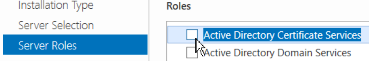

  > The **Add Roles and Features Wizard** will prompt you to <!--Next prompt: capitalized or all lowercase?-->**_Add required features_**. 

  3. Add the desired features, and then follow the wizard's prompts. 
  4. Locate and select **Role Services**. 
  5. At this point, ensure that you **deselect** (uncheck) the checkbox for **Certification Authority**, and click on the checkbox to select **Online Responder**.

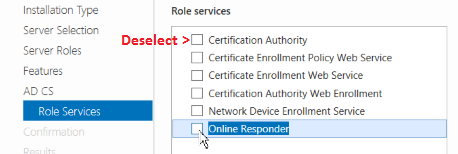

  > The wizard will then prompt you to **_Add features that are required for Online Responder_**. 

  6. Click on **Add features**. 
  7. Continue with the wizard's prompts, <!-- Assume wizard's prompts are easy since not stated.  --> and click on **Install**.
  
  > After the installion finishes, the **i - Feature Installation** window appears. 
  
  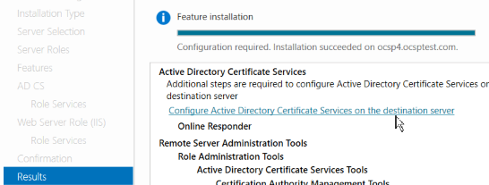
  
  8. Select **Results** from the left-hand-side panel. 
  
  > The prompt, _Configuration required. Installation suceeded on [server name]_ appears. <!--"Server name" correct for generic info.? -->
  
  9. In the **Results** window, below the **Active Directory Certificate Services** heading, click on **Configure Active Directory Certificate Services on the destination server**.

  > If you are logged into the server with (at least) local administrator rights, you do not need to change the credentials in the **AD CS Configuration** wizard. <!-- Does this wizard pop up automatically? How do you find it? Do you click on it? --> 

  10. Click through the wizard prompts. Then, click on **Configure**.  When the configuration finishes, click on **Close**. 
  11. Close the **Add Roles and Features Wizard**. 
  
  > As a best practice, reboot the server before continuing.

### Obtain OCSP Responder CA certificate

Two main approaches exist for the Microsoft OCSP Responder's method of issuing and obtaining certificates:
  
  * **Preferred**: the OCSP Responder will obtain a certificate from an offline CA and manually install it.  This approach, which is described below, will provide increased security over the second approach. <!-- If preferred, this one should come first. Is it more or less secure than other appraoch? Install it where? -->
  
  * **Alternative**: The OCSP Responder will have permissions to automatically request a certificate <!-- Is this the certificate for the OCSP Responder itself?  Is the OCSP Responder the same as the Windows Server 2012 R2? -->from an online Microsoft CA that resides on the same domain. This approach, if used in a dedicated, network-isolated domain with HSMs, can be relatively secure.  (Information on this approach is available from ______.)  

> <i class="icon-info"></i>  Regardless of which approach you use, Microsoft Windows Clients require every certificate in the certificate chain, **including the self-signed Root**, to express **OCSP Signing (1.3.6.1.5.5.7.3.9)** in the **Extended Key Usage** extension. 

To use the **Preferred** approach to issuing and obtaining certificates, perform the following steps: 
  
  1. Generate a new **signing key and certificate request file** by creating an **INF** (i.e., Information File Name [INF] extension) file that specifies the details you wish to include in the request. For an example, see [Appendix 1 - Sample OCSP INF file](#Appendix-1---Sample-OCSP-INF-file-1). 
  
  2. Once you've created an INF file, open an administrative command window on the server and enter the following command:

	certreq -new <inf_filename>.inf ocsp.req

  > This command should generate a new signing key and output a **signed certificate request** to **ocsp.req**.  

  3. Deliver this request file to your CA and obtain your OCSP Responder certificate<!--How do they deliver it and in what form (e-mail?) will they obtain this certificate?-->. 
  
  > **Note:** The certificate you receive will be Privacy-Enhanced Mail (PEM)-encoded. 
  
  4. Open Microsoft Notepad. <!-- Is this what you meant? Purpose to retain the certificate? -->Then, copy, paste, and save the file to retain the certificate..

  5. Verify that the new certificate meets all of the OCSP Responder requirements:
  > * OCSP Signing (1.3.6.1.5.5.7.3.9) in the Extended Key Usage.  
      &mdash; This *should* be marked **critical.**  
  > * The id-pkix-ocsp-nocheck (1.3.6.1.5.5.7.48.1.5) extension is present.  
      &mdash; Including this extension prevents clients from checking the OCSP Responder certificates' revocation status.
  > * Key Usage must contain Digital Signature (80).  
      &mdash; This *should* be marked **critical.**
  > * The Subject Alternative Name *should* contain Domain Name Server (DNS) Name = OCSP Server DNS name.

### Install OCSP Responder CA certificate

  1. Copy the new OCSP Responder certificate, as well as the issuing CA certificate (or chain), to the OCSP Responder server.<!-- How? -->
  2. If you have not yet done so, install the issuing **Root CA certificate** <!-- How? Below the term, "Root CA," is used. Keep terms the same as much as possible. -->in the **Computer Trust Root Certification Authorities store**. 
  3. Use the following command to accept <!-- Is this a "paste" function? Step 1 says "copy." I find the 3-step sequence confusing.  Can you add more info? -->the OCSP Responder certificate: 

	certreq -accept <ocsp_responder_certificate_filename>.cer

  > When successful, _certreq_ will exit and provide no feedback.

> <i class="icon-info"></i>  An error message stating: **_Certificate Request Processor:  A certificate chain could not be built to a trusted root authority. 0x800b010a (-2146762486 CERT_E_CHAINING)_** will indicate that the self-signed root (and intermediate CA certificates, if applicable) are not available or not in the correct certificate stores on the server. Ensure that the required CA certificates are imported into the correct **Computer account** stores (i.e., certificate stores). 

  4. To confirm that the certificate was properly imported, open the **Microsoft Management Console (MMC)** (i.e., **mmc.exe**), load the **Certificates snap-in**, and select the **Computer account** (i.e., stores). <!-- Correct?  Can't tell what the step sequence is from the screen capture. -->
  5. From the left-hand panel, under the **Console Root** folder, click on **Certificates (Local Computer)** and then click on the **Personal** folder.  
  6. Click on the **Certificates** folder. Then, expand the **Personal/Certificates** tree on the right-hand-side of the window. 
  7. Confirm that the newly accepted OCSP Responder certificate is listed there.

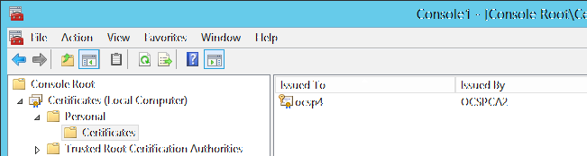

  8. Double-click on the certificate. Confirm that it is valid<!--What does it say to indicate validity? -->; lists *OCSP Signing* under _This certificate is intended for the following purpose(s)_; and indicates that *You have a private key that corresponds to this certificate*. 
  9. Close the certificate. <!-- How do you close it? -->

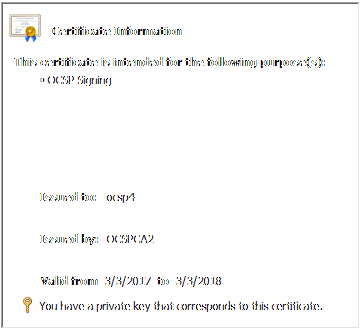

  10. Right-click on the certificate in MMC, and select **All Tasks** and then **Manage Private Keys**.

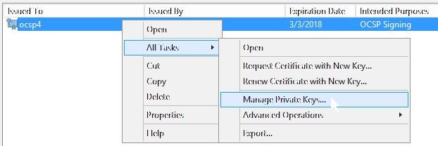

  11. When the **Permissions** dialog box appears, click on the **Add** button.

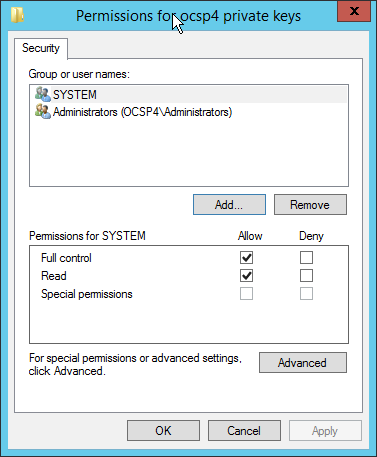

  12. If this server is on a domain, click on the **Locations** button, and select the local server's name. 
  13. Type **NETWORK SERVICE** into the **Enter the object names to select** text box, and click on the **Check Names** box. Click on **OK** when finished.
  
  > The **Permissions for [server name] private keys** window displays. 

  14. From the **Permissions...** window, select **NETWORK SERVICE**, deselect (uncheck) the **Full control** checkbox, and then click on **OK**.

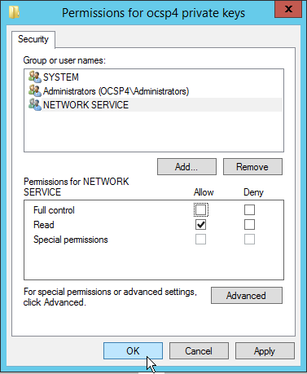

  > The OCSP Responder should now be able to use the certificate and private key.

### Configure Revocation Sources

Every issuing and intermediate CA certificate to be supported by the OCSP Responder must have their own entry in **Revocation Configuration.** <!-- Where is Revocation Configuration located? -->

#### Manually add a Revocation Source

In the example images below, _Federal Bridge CA 2016_, is used as an example of a revocation source.

  1. Open the **Online Responder Management** console.  At the right-hand panel under **Online Responder**, right-click on Revocation Configuration, and then select **Add Revocation Configuration**.

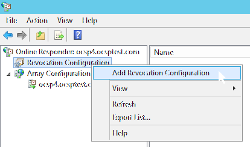

  2. At the next window, select **Name the Revocation Configuration**.  Then enter the name of your Revocation Configuration. (It is recommended that you always use the CA's common name, plus any other identifying information that may be necessary.) Click on **Next**.

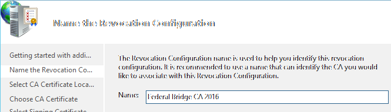

> <i class="icon-info"></i>  You will need to configure separate Revocation Configurations for CAs that have more than one key pair. Name your Revocation Sources so that you can easily identify these cases.

  3. At the next window, select a **CA Certification Location**. The location can be either a Local certificate store or a File. Click on a radio button to select a location. Click on **Next**, select the CA certificate, and then click **Next** again.

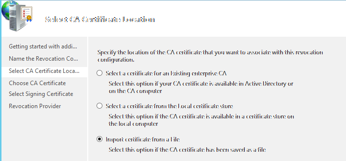

  4. At the next window, click on the radio button next to **Manually select a signing certificate**. Click on **Next**.

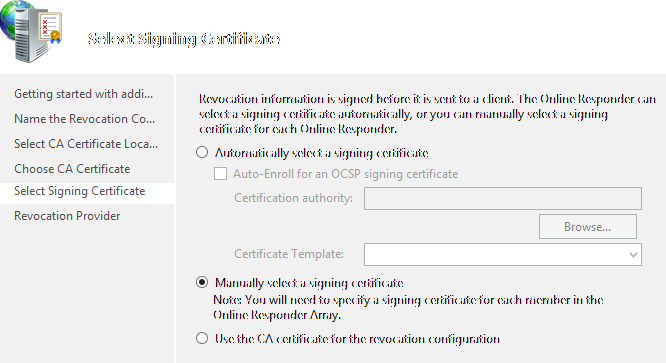

  > An error (dialog box) will appear stating that _One or more errors occurred while revocation provider settings were being configured.  Click the "provider button" to configure the revocation provider manually_... Click on **OK**.

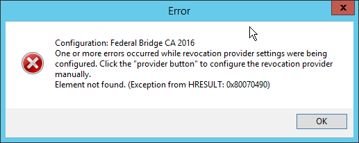

  5. At the next window, click on the **Provider** button to open the **Revocation Provider Properties** dialog box.

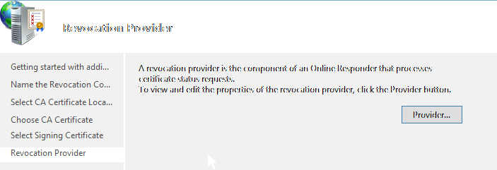

  6. Click **Add**, and then copy and paste the CA's **CRL distribution point URL** into the **Add the...CRL at this address (URL) to the list:** text box. (**Note:**  This URL is the CRL distribution point URL that this CA puts into the certificates it issues, **not** the URL in the CA certificate itself.) Click on **OK**.

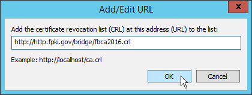

  7. At the **Revocation Provider Properties** dialog box, deselect (uncheck) the checkbox next to **Refresh CRLs based on their validity periods**. (**Note:** This option has proven unreliable in testing.) At **Update CRLs at this refresh interval (min)**, enter a reasonable refresh interval, such as _60 minutes_, and click on **OK**.

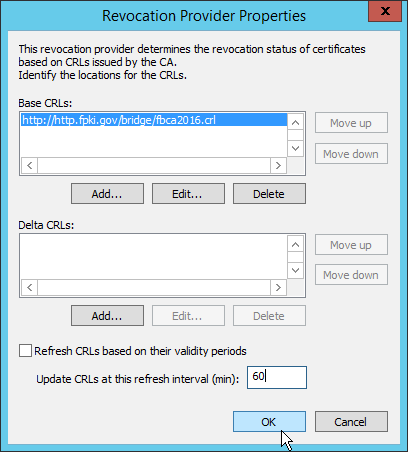

  > After completing the above steps, you will need to assign the OCSP Responder Certificate to the configuration. Until this is done, you will see the error:  _Signing Certificate: &nbsp;Not Found_ in the status panel window for this Revocation Configuration. 

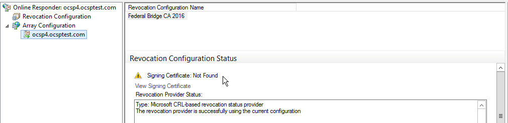

  8. In the status panel window, right-click on the Revocation Configuration Name itself ("Federal Bridge CA 2016" in this example), and then select **Assign Signing Certificate**.

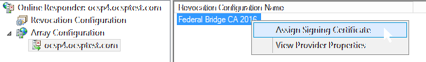

  > A **Windows Security** dialog box will appear that allows you to select a **Signing Certificate** (i.e., the OCSP Responder certificate). Click on the correct certificate, and click on **OK**.

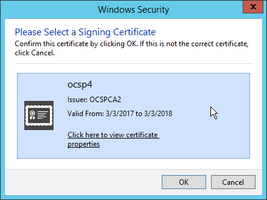

  > After selecting the certificate, the status panel will still display an error stating that *The data necessary to complete this operation is not yet available.* What this really means is that it has not yet downloaded the CRL. <!-- What is "it" here? -->

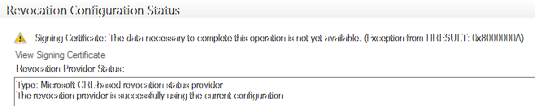

  > After a few minutes, right-click on **Array Configuration** at the status panel window, and select **Refresh**. <!-- How many minutes before clicking on Refresh? -->
  
  > The downloaded CRL will appear in the _____ window.

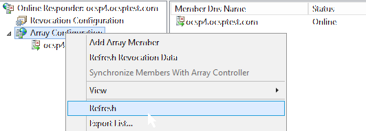

  > Once the download finishes, your status panel window should look like this:

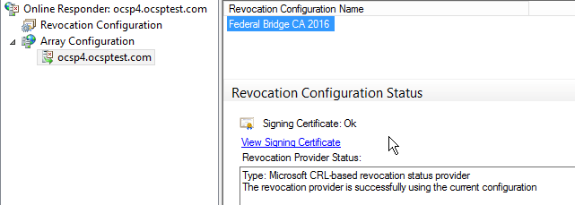

  > If the error message appears: **_The revocation provider failed with the current configuration. The object identifier does not represent a valid object. 0x800710d8 (WIN32: 4312 ERROR_OBJECT_NOT_FOUND), 0x800710d8_**. This error indicates an incorrect CRL DP URL. <!-- What is "DP"? -->

  9. Repeat this process for each CA that you want to add to the OCSP Responder.

## Configure the Windows Client<!--Shouldn't this title be "Manually configure the Windows Client" (subtitle just below)? Looks like a repeat of the same title idea. -->

You will need to configure each CA that you want to add to the OCSP Responder. <!-- Correct? -->In addition, to maximize local availability<!-- Explain "maximize local availability." -->, you will need to configure each CA in the certificate chain to your trusted root certificate(s) (for example, any CAs that can verified by the Federal Common Policy CA). <!-- This paragraphic was not close to plain language. Can you simplify? Will all users know what Federal Common Policy CA is?  (Also referred to as "COMMON"?) Will users of this guide ALL need to configure CAs that can be verified by FCPCA? -->

### Manually configure the Windows Client <!--There isn't an opposing title like Automatically configure the Windows Client.  If all related steps pertain to manual configuration, then delete this title and add *Manually* to the Heading 2 just above. -->

To manually configure a locally trusted, OCSP Responder, **use the ""MMC** **Certificates snap-in**.   

  1. To begin, open MMC (i.e., mmc.exe).  At the screen's left-hand panel below **Console Root**, add the Certificates snap-in for the **Certificates (Local Computer)**. <!-- Right sequence? -->

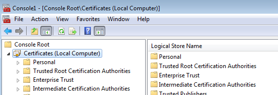

  2.  Under **Intermediate Certification Authorities** and then select **Certificates.** 
  
  3. Next, at the right-hand panel, under **Issued To,** select the **CA certificate** that you want to associate with the locally trusted, OCSP Responder. <!-- Original had unclear meaning. Grammar implied that the CA certificate is already active somehow and waiting for an item to be assigned to it.  Once the OCSP Responder is assigned to the already active CA certificate, the OCSP Responder becomes "active." Correct? --> Then, right-click on the certificate and select **Properties** from the drop-down window.
  
  > The **Properties** window appears.

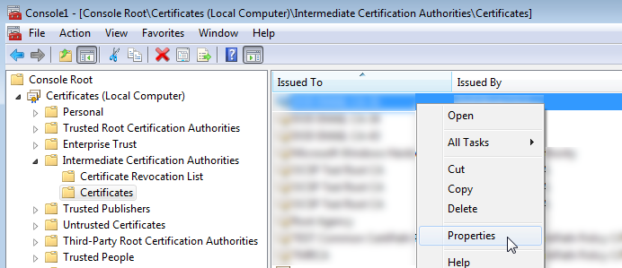

  4. Click on the **OCSP** tab.  In the text box, enter the **URL of your locally trusted, OCSP Responder**.

  > The Microsoft <!-- The "Microsoft" OCSP Responder has not been mentioned before. Is it the same as the "OCSP Responder" or different? -->OCSP Responder adds **ocsp** to the URL, e.g., http://[servername]/ocsp.

  5. Click on the **Add URL** button. 

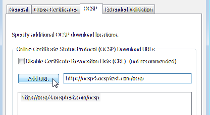
  
  6. Confirm that the URL appears in the text box list.

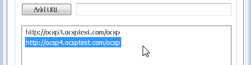

  > By using the same window used in Steps 4-6 above, you can add and configure multiple OCSP Responder URLs.

  7. Click on **OK** when satisfied with all of the OCSP Responders you have added. 
  
  > Now, all applications that use Windows certificate validation Application Programming Interfaces (APIs) will use your configured OCSP Responder when validating certificates *issued* by this CA.

### Configure the Group Policy

#### Locate and import the Locally Trusted Root CA Certificate <!-- Caps needed? -->

You can distribute the **locally trusted root CA** to Windows Clients using **group policy** functions. 

  1. To do this, create or open the **Group Policy** object you want to use, and then navigate to:
  
  > **Computer Configuration**/**Policies**/**Security Settings**/**Public Key Policies**/**Trusted Root Certification Authorities**. 
  
  2. If the **root CA certificate** is not already listed<!--Listed where? What window?-->, from the drop-down menus, right-click on **Trusted Root Certification Authorities** and select **Import**.

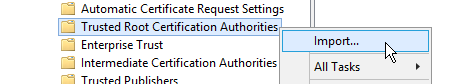

  > The **Certificate Import Wizard** will appear. 

  3. Click on **Next**. Browse the certificates list <!--certificates list?-->to locate the **Locally Trusted Root CA certificate** that issues the OCSP Responder certificates.<!--What will it say specifically?--> Click on **Next** and then **Next** again. Then, click on **Finish** to import the certificate. 
  
  > A dialog box will appear that states *The import was successful*.

#### Configure a locally trusted, OCSP Responder

You can also configure Microsoft Windows domain members using **group policy** functions. 

  1. To do this, first create or open the **group policy object** you want to use<!--From where? How do they know which one they want to use? Is any screen/menu function actually called Group Policy?-->, and then go to:
  
  > **Computer Configuration**/**Policies**/**Security Settings**/**Public Key Policies** 
  
  2. Next, select the **certificate store** that contains the **CA certificate for the locally trusted, OCSP Responder** from the drop-down menu. The certificate store is usually called the **Intermediate Certification Authorities**.

  > In the certificate store, you should already see a CA, such as the self-signed Federal Common Policy CA<!-- What is the purpose of telling the user about this? Used the term, "certificate store," just above. Keep terminology the same.-->.

  3. Right-click on the certificate store name (e.g., **Intermediate Certification Authorities**) and select **Import**.

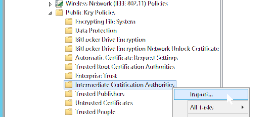

  > The **Certificate Import Wizard** will appear.
  
  4. Click on ***Next**, and then click on the CA certificate that you want to configure.

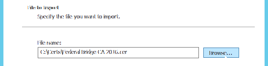

  5. Click on **Next** and then on **Next** again. Finally, click on **Finish**. 
  
    > A dialog will appear that states:  *The import was successful*.

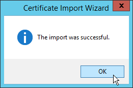

  6. To configure the locally trusted, OCSP Responder, right-click on the imported certificate and select **Properties**. 

  7. Add the OCSP URL(s) as you did above in Steps 4-7 under [Manually configure the Windows Client](#Manually-configure-the-Windows-Client-1)

## End-to-end testing of locally trusted, OCSP Responder <!--Correct?-->

### Testing with Windows Clients <!--Correct?-->

#### Prepare for testing 

From the Windows Client command line, you will use the **certutil.exe** to test all Windows versions that will operate in your local area network.  
  
> <i class="icon-info"></i>  <!--Probably should be an alert box?-->An apparent bug exists when you use **certutil** with Windows 10. If it does, you will see this error: **_FAILED: 0x80092004 (-2146885628 CRYPT_E_NOT_FOUND)_**, even when a certificate path seems to validate correctly. If this occurs, we suggest testing other Windows versions. As of May 2017, Windows 7 and 8.1 do **not** have this issue.

  * If you are using **group policy** to push locally trusted, OCSP settings to Windows Clients, ensure that the updated policy has been applied to each Client.

  * Ensure that you have copies of all certificates that were **issued by** the CAs that you configured as OCSP Responders <!-- Meaning correct? -->. These tests will build a complete certificate path to a trusted root<!-- The Root CA? -->.  (**Note:**  If intermediate CA certificates are part of your tested path, it is not necessary to test them independently.)
  
Follow these steps to prepare for your tests: <!--Overall purpose of these steps?-->

  1. Enable the Microsoft CAPI2 login <!-- Said "logging"...? -->on your Client. <!-- How does the user do this? -->Open the **MMC Event Viewer snap-in**, and then go to:
  
  > **Applications and Services Logs**/**Microsoft**/**Windows**/**CAPI2**/**Operational** 
  
  2. With "Operational" selected, click on **Enable Log** in the **Actions** pane<!--Left-hand panel? No screen capture to verify. -->. 
  
  3. The default log size is 1 MB. To increase the log size, click on **Properties**, and then your desired log size. (The maximum size is recommended.) <!-- What is the max size?  Moved the "Disable Log" step to end of testing, since it should be done after user completes testing. --> 
 
  5. Next, install the required intermediate CA certificates (if they are not already in the **Intermediate Certification Authorities store**) to validate the test certificates. 
  
  6. Double-click on each certificate to verify that each test certificate path is built. Confirm that each one is valid and has a certificate path in the **Certification Path tab**. 

> <i class="icon-info"></i>  The additional events that appear when following<!--Following how?--> Authority Information Access (AIA) URLs to retrieve Intermediate CA certificates are not included or addressed below. <!--Is there a link/source the user should go to for help with these events?-->

  > Optionally, you may want to isolate the test Client from the Internet. We highly recommend doing this if the locally trusted OCSP will be used for ongoing operations when disconnected from the Internet. If this is the case, the Client should be able to validate configured certificates through access to only the locally trusted OCSP Responder. There are also other ways to achieve this effect<!--What effect? Being disconnected from the Internet (unclear)?-->; one approach is to remove all DNS server entries from the Client and add the OCSP Responder to the host file. If you use this approach, ensure that you clear the DNS cache before testing by using:

	**ipconfig /flushdns**

#### Execute testing

  1. Open the **Event Viewer** and go to:
  
  > **Applications and Services Logs**/ **Microsoft**/**Windows**/**CAPI2**/**Operational**. 
  
  2. Click on **Clear Log** in the **Actions** pane.

  3. To clear all of the cached certificates, CRLs, and OCSP responses, open a command prompt and enter the following command, replacing "certificate.cer" with the path and file name of a certificate:

    **certutil -URLcache * delete**

  4. To generate detailed output about the content of each certificate in the certificate path (concluding with whether or not the certificate path was successfully validated), enter the following command:     
    
    **certutil -verify "certificate.cer"**

  > For example:

    Verified Issuance Policies:
	    2.16.840.1.101.3.2.1.3.6
		2.16.840.1.101.3.2.1.3.7
	    2.16.840.1.101.3.2.1.3.14
		2.16.840.1.101.3.2.1.3.15
    Verified Application Policies: All
    Cert is a CA certificate
    Leaf certificate revocation check passed

    CertUtil: -verify command completed successfully

  > If the validation fails, you will see the message: **CertUtil: -verify command FAILED**, along with an error code. It can sometimes be difficult to ascertain what went wrong from the **certutil** output; however, the CAPI2 log contains much more detail. The [Common Problems and Solutions](Common-Problems-and-Solutions-1)<!--What "Troubleshooting" as alternate title?--> section may help you diagnose and correct problems.

> <i class="icon-info"></i>  To simplify examination of the event log entries, prepare your command line window or a batch file before clearing the log, then execute the test commands and immediately refresh the **Event Viewer** window. These steps will rapidly reduce the likelihood of unrelated certificate activities being present in the log.

  5. If path validation was successful, you must examine the CAPI2 log entries to ensure that your locally trusted, OCSP Responder is functioning successfully for each certificate in the path for which you configured it. Step through the sequence of events from first to last for the entire path. Click on the **Details** tab to examine the contents of each event.

>  <i class="icon-info"></i>  The possible events are detailed below in chronological order. It may be easier to examine the events in reverse order in the **Event Viewer**. Click on the **Data and Time** column at the top of the **Event Viewer** list so that the events display in the order shown in the table below.

  > The test begins with **Event ID 10**: **Build Chain**, where you will see **CertGetCertificateChainStart** and [**ProcessName**]  **certutil.exe** in the **UserData**:

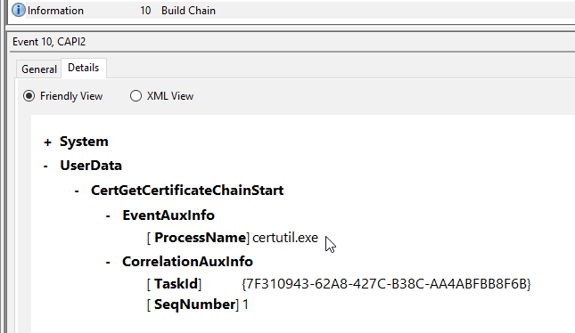

  6. Monitor the **CorrelationAuxInfo** &mdash; **TaskId** and **SeqNumber** fields in this event. As the validation proceeds, the **TaskId** remains constant and the **SeqNumber** will increment for each subsequent log entry. If the TaskId changes, then you are looking at an unrelated event.

  > The first **Event ID 10** should be followed by the **Verify Revocation** sequence that starts with **event 40** and ends (if successful) with **event 41**. The table below contains the sequence of events that should appear when using your locally trusted, OCSP Responder to check certificate revocations<!--CRLs?-->.

| **Event ID** | **Task Category** | **Details** |
| :----------: | :---------------- | :---------- |
| 40 | Verify Revocation |  |
| 52 | Retrieve Object from Network |  |
| 53 | Retrieve Object from Network | **UserData** / **CryptRetrieveObjectByUrlWire** / **URL** contains a URL for the OCSP Responder |
| 10 | Build Chain |  |
| 11 | Build Chain | **UserData** / **CertGetCertificateChain** / **Certificate** [**subjectName**] displays the common name of your OCSP Responder |
| 30 | Verify Chain Policy |  |
| 41 | Verify Revocation | **UserData** / **CertVerifyRevocation** / **OCSPResponse** [**url**] contains a URL for the OCSP Responder  |

  7. Examine each instance of **event 41** in the log. If **UserData**/**CertVerifyRevocation**/**IssuerCertificate** [**subjectName**] is a CA for which you configured an OCSP URL, examine the remaining details of the event. Confirm that **UserData**/**CertVerifyRevocation** /**OCSPResponse** [**url**] contains a URL for the locally trusted, OCSP Responder. If you find a different URL or no **OCSPResponse** section, then it<!--"it" refers to what?-->did not use the OCSP Responder.

> <i class="icon-info"></i>  The URL that appears in the event log contains the base-64-encoded, OCSP request.

  8. After you have completed your testing, disable the log, because the log will degrade preformance. To do this, click on **Disable Log** in the **Actions** pane. 

### Problems and solutions <!-- Troubleshooting...? -->

The table below lists some event log errors you could encounter, their possible causes, and possible solutions.

| **Error Event ID** | **Task Category** | **Details Contain** | **Possible Cause(s)**
| :----: | :----------------------- | :---------------------- | :------ |
| 11 | Build Chain | A certificate chain could not be built to a trusted root authority. | If this error is preceded by event sequence 40/52/53/10, verify installation of the locally trusted, OCSP Root CA certificate. &nbsp;&nbsp;&nbsp;&nbsp;*- or -* If this error appears immediately following the first event 10, a path could not be built for the certificate you are attempting to verify. Ensure that all required intermediate CA certificates are available and that the necessary root is installed.|
| 42 | Reject Revocation Information | CertRejectedRevocationInfo - OCSPResponse \[url] *\[your local OCSP Responder]* and Actions \[name] **CheckTimeValidity** | The OCSP Responder system clock is incorrect. &nbsp;&nbsp;&nbsp;&nbsp;*- or -* An expired CRL is being used by the OCSP Responder. Confirm that the "Refresh CRLs based on their validity periods" is NOT enabled in the Provider properties; configure a refresh interval instead. |
| 42 | Reject Revocation Information | CertRejectedRevocationInfo - OCSPResponse \[url] *\[your local OCSP Responder]* and Actions [name] **CheckResponseStatus** | The OCSP Responder returned "Not Authorized" because it has not been configured to respond for this CA. You will see this error if you configure the Revocation Source for an issuer without adding the corresponding configuration to the OCSP Responder. |
| 53 | Retrieve Object from Network | CryptRetrieveObjectByUrlWire - URL *\[Your OCSP Responder]* | OCSP Responder is stopped, server is offline, or server is unreachable. |
| 53 | Retrieve Object from Network | CryptRetrieveObjectByUrlWire - URL *\[CRL or OCSP other than your local OCSP Responder]* | Unless preceded by the Error Event 53 described in the previous row, you should not see this error. If this occurs, confirm the Revocation Sources are configured for the Issuing CA. |

  > If the above table doesn't lead you to a solution, the Microsoft TechNet article: [Troubleshooting PKI Problems on Windows Vista](https://technet.microsoft.com/en-us/library/cc749296(v=ws.10).aspx) may help. (This article has proven to be useful with everything from Windows Vista to Windows 10 and Server 2012 R2.)

## Appendix 1&mdash;Sample OCSP INF file

The INF file below is a configuration file example that you can use to generate a new certificate-signing request for the OCSP Responder.

 - Customize the Subject field in accordance with your Issuing CAs name
	 - The example below could be submitted to CA "CN=OCSP Issuing CA,DC=agency,DC=local"
 - Ensure KeyLength is set in accordance with the CA key sizes for which you intend to provide OCSP responses
 - If you are using an HSM, you will need to modify the ProviderName, per the HSM documentation

Sample INF file for generating the OCSP Responder certificate request:

	[NewRequest]
	Subject = "CN=Local OCSP Server, DC=agency, DC=local"
	PrivateKeyArchive = FALSE
	Exportable = FALSE
	UserProtected = FALSE
	ProviderName = "Microsoft Software Key Storage Provider"
	ProviderType = 1	
	MachineKeySet = TRUE
	UseExistingKeySet = FALSE
	KeyLength = 2048
	RequestType = CMC
	
	[EnhancedKeyUsageExtension]
	OID="1.3.6.1.5.5.7.3.9"
	
	[Extensions]
	; id-pkix-ocsp-nocheck
	1.3.6.1.5.5.7.48.1.5 = "{hex}05 00"
	; the following is only needed if submitting to a CA that has multiple keys
	; uncomment and set the example hex string to the Subject Key ID of the CA
	; 2.5.29.35="{hex}30 16 80 86441F15A89DA7CA3F09F643FFE31EE9C6FC0CD6"
	
	[ApplicationPolicyStatementExtension]
	Policies = OCSPSigning
	Critical = FALSE
	
	[OCSPSigning]
	OID = 1.3.6.1.5.5.7.3.9

## Appendix 2&mdash;Using Microsoft CA as the self-signed root

Prior to configuring Certificate Services and generating a new Root CA key pair, place the **CaPolicy.inf** file (as below) in **%SYSTEMROOT%**.  This will create a self-signing, root certificate with a 2048-bit RSA key and a 10-year validity period with **OCSP Signing (1.3.6.1.5.5.7.3.9)** in the **Extended Key Usage** extension. 

  > Sample CaPolicy.inf :

	[Version]
	Signature="$Windows NT$"

	[AuthorityInformationAccess]
	; This extension will be omitted

	[CRLDistributionPoint]
	; This extension will be omitted

	[Extensions]
	; Key Usage = CertSign & CrlSign
	2.5.29.15=AwIBBg==
	Critical=2.5.29.15 

	[EnhancedKeyUsageExtension]
	OID=1.3.6.1.5.5.7.3.9 	; ocsp signing
	Critical=No

	[certsrv_server]
	LoadDefaultTemplates=0
	RenewalKeyLength=2048
	RenewalValidityPeriod=Years
	RenewalValidityPeriodUnits=10

	[BasicConstraintsExtension]
	PathLength=0
	Critical=True

> <i class="icon-info"></i>  When configuring a new CA, the **Setup Wizard**<!--Name of Setup Wizard?--> may default to using 2048-bit RSA with SHA-1. At a minimum, change this setting to 2048-bit RSA with SHA-256.

  > Prior to issuing OCSP Responder certificates, you must enable the **OCSP-No-Check** extension using the following commands:

	certutil -v -setreg policy\EnableRequestExtensionList +1.3.6.1.5.5.7.48.1.5
	-or-
	certutil -v -setreg policy\editflags +EDITF_ENABLEOCSPREVNOCHECK
	
	net stop certsvc
	net start certsvc

If the new CA is dedicated to issuing OCSP Responder certificates, you may want to disable the **CDP** and **AIA** extensions inside the **Certification Authority MMC snap-in** to improve efficiency. <!--Efficiency related to what?-->If so, simply uncheck the checkboxes for the **"Include in the CDP/AIA extension of issued certificates"** for each URL in the **Extensions** tab. (These extensions are not needed by the OCSP Clients.)

