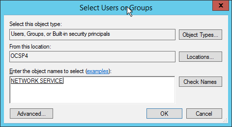
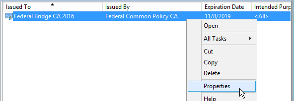

# Locally Trusted OCSP Configuration

#### Table of Contents
#### [Introduction](#introduction-1)
#### [Security Risks](#security-risks-1)
#### [Prerequisites](#prerequisites-1)
#### [Install Microsoft OCSP Responder](#install-microsoft-ocsp-responder-1)
#### [Windows Client Configuration](#windows-client-configuration-1)
#### [End-to-End Testing](#end-to-end-testing-1)

----------

## Introduction
Within the Public Key Infrastructure (PKI), the Online Certificate Status Protocol (OCSP) is used to determine the status of a public key certificate (RFC 2560, FIPS 201-2). An OCSP Responder <!-- Is Responder correct here or should it be "Client and Responder"? -->can functionally replace Certificate Revocation Lists (CRLs), which are "list[s] of revoked public key certificates created and digitally signed by a Certification Authority" (CA) (FIPS 201-2, NIST SP 800-63, CNSSI 4009). A response from an OCSP Responder<!-- a definition would be helpful. -->, as with a CRL, will tell you whether a public key certificate has been revoked by its CA (i.e., the issuer that certified it in the first place). If your organization relies on Internet-hosted sources <!-- Are Internet-hosted sources ever "internal"? -->for your local network's critical functionality, including the ability to verify certificate statuses, you could use an OCSP Responder, instead of CRLs. <!-- availability of what? -->In this case, your locally trusted OCSP Responder (service) would create a locally hosted, trusted copy of revoked certificate information<!-- Copied from where? -->. Hosting a local OCSP Responder can ensure that clients (applications and devices)<!-- Correct for "clients"? -->do not experience the Internet disruptions, outages, or problems <!-- Problems like...? -->that can occur with either remotely hosted CRLs or OCSP.

If a locally trusted OCSP Responder <!-- Responder?  Client and Responder? -->is deployed, even mobile clients such as laptops, tablets, and phones could potentially <!-- Explain "potentially." -->use it when remote<!-- "Remote" means using wireless capability that is not part of an agency's or company's wireless? --> (i.e., if your organization configures the OCSP Responder to be exposed to the Internet). Clients (applications and devices) should always be configured to "fail-over" to a backup<!-- Backup vs. "next" is more clear. --> source for obtaining certificate-revocation statuses in the event of an Internet disruption, outage, or problem. <!-- Are you saying that the OCSP Responder can be that backup source (unclear)? -->A locally trusted OCSP Responder could be that backup source--providing additional resiliency for users who are working on your local network or connected remotely. If considering this service, we highly recommended increasing its security by choosing a server name associated with an Internet Protocol (IP) <!-- Did you mean IP? -->address, as discussed in the **"xxxxx section below xxxx.**

  >> **Transparent Caching Proxy -- an Alternative Backup (Fail-over) Method.** The **Transparent Caching Proxy** may <!-- "May" sounds uncertain. What could be the problem area? -->provide sufficient backup resiliency<!-- Does this method provide greater security? If so, we ought to say that. --> to preclude the need for a locally trusted OCSP. When configured properly<!-- Explain "proper configuration. -->, a Transparent Caching Proxy is a highly effective method of obtaining and providing CRLs during Internet, CRL, or OCSP service disruptions. This proxy also greatly reduces Internet connection-bandwidth consumption. To use this system, configure it to frequently check the end-point <!-- End-point is what? Need clarification. Also, explain file types that follow. -->for modified **.p7c** and **.crl** files so that the cache maintains the most up-to-date information. In addition, consider configuring a script on any host "behind" the transparent cache to regularly download chosen CRLs. This will keep the cache "fresh" even when users on the local network are not downloading CRLs during off-peak (i.e., non-working) hours.<!-- How does user download of CRLs during off-peak hours effect freshness of cache (unclear)? --> For additional information on configuring a Transparent Caching Proxy, see _(insert link to relevant document here)_.

## Security Risks
By operating a locally trusted OCSP Responder, you are assuming all security risks introduced by not depending directly on the authoritative revocation status sources. <!-- LL has given guidance about doc. prep. that we are to assume the reader has no prior knowledge of the subject matter.  An example of an "authoritative revocation status source" and what kind of threat(s) could result from assuming the risks would be helpful. -->CAs follow stringent policies and procedures involving those for multi-person control<!-- Explain "multi-person control" for reader. -->, physical security<!-- How does physical security relate? -->, and hardware cryptographic modules. These requirements are detailed in each CA's Certificate Policy (CP) and Certification Practices Statement (CPS).  If you do not implement equivalent security controls, then your local OCSP Responder becomes the weak link in the chain; the overall assurance level should effectively be reduced to that of your local configuration. For example, if you are validating PIV authentication certificates (hardware), but you are using software cryptographic keys on your local OCSP Responder, then the assurance level of the validated certificates may be viewed as software assurance rather than hardware. This may be perfectly acceptable for some use cases while for others it is not. This is a local risk decision that should receive careful consideration and shape your deployment design.

A locally trusted OCSP Responder should never be trusted by any clients that are not explicitly configured to trust it. Therefore, the CA you use should by private to your organization. The CA and issued OCSP Responder certificates should not be trusted outside of your intended pool of clients for any purposes. 

A common misunderstanding is viewing an OCSP check is the same thing as certificate validation - this is a dangerous and completely inaccurate assumption. The proper procedures for certificate path validation can be found in section 6 of [RFC 5280](https://www.ietf.org/rfc/rfc5280.txt), _Internet X.509 Public Key Infrastructure Certificate and Certificate Revocation List Profile_.

## Prerequisites
#### Required
 - A locally trusted CA to issue OCSP Responder certificates
 - Windows 2012 R2 server

Owing to its' limited, local only, scope and special requirements on its' content, it is recommended that a new, dedicated Root CA be used for issuing the locally trusted responder certificates. Some additional details can be found in the procedures below and in [Appendix 2 - Using Microsoft CA as the self signed root](#Appendix-2---Using-Microsoft-CA-as-the-self-signed-root-1)

#### Recommended:
 - Hardware Security Module (HSM)
 - Certificate Policy (CP) and Certification Practices Statement (CPS):  Documented security policies and procedures for deployment and operation OCSP Responder certificate issuing CA and the OCSP Responder(s).
	 - Recommend leveraging one or more relevant CP(s) published by a CA(s) you rely on for requirements.

> <i class="icon-info"></i>  CA installation, HSM configuration, and policy documents are not covered in detail by this document.

Before you begin, it is recommended that you review the [Implementing an OCSP Responder](https://blogs.technet.microsoft.com/askds/2009/06/24/implementing-an-ocsp-responder-part-i-introducing-ocsp/) series on Microsoft TechNet. These documents include supporting information that has been omitted from this document.

## Install Microsoft OCSP Responder
Microsoft Windows Server 2012 R2 was chosen for inclusion in this document because it is generally available across Federal agencies. Please note that other products may be configured to provide locally trusted service and until such time as additional guidance is available you are encouraged to speak directly with these product vendors regarding configuration. 

### Software Installation
Before beginning the installation, ensure your server is named and joined to the appropriate domain. Changing the server name or domain after installation can corrupt the configuration. Your server will also need outbound Internet access to download remote CRLs. In most cases, CRLs are available over HTTP/80.

Use the *Add Roles and Features Wizard* to add the *Active Directory Certificate Services* (ADCS) role to Windows 2012 R2.

The wizard will prompt you add required features, add them, and then continue through the wizard until you reach *Role Services*. At this point, ensure you remove Certification Authority, and add Online Responder.

The wizard will prompt you to *Add features that are required for Online Responder*, click *Add features*, then continue with the wizard and click *Install*. After the wizard finishes installing, click *Configure Active Directory Certificate Services on the destination server* inside the Results window.

Assuming you are logged on the the server with (at least) local administrator rights, it is not be necessary to change the credentials in the *AD CS Configuration* wizard. Click through the wizard, click *Configure* then *Close* when it finishes. You can now close the *Add Roles and Features Wizard*. As a best practice, you may wish to reboot the server before continuing.

### Obtain OCSP Responder Certificate
There are primarily two different approaches for obtaining certificates for the Microsoft OCSP Responder implementation. In one approach, the Online Responder has permissions to automatically request certificates from an online Microsoft CA on the same domain. If done in a dedicated, network isolated domain with hardware security modules, this approach can be relatively secure. The other option, which is described to a an extent below, is to manually install a certificate which you obtain from an offline CA.

> <i class="icon-info"></i>  Regardless of the certificate issuance approach, Windows clients require every certificate in the chain, *including the self signed root*, to express OCSP Signing (1.3.6.1.5.5.7.3.9) in the Extended Key Usage extension.

The first step is to generate a new signing key and certificate request file. You will need to create an INF file that specifies the details to include in the request. See [Appendix 1 - Sample OCSP INF file](#Appendix-1---Sample-OCSP-INF-file-1) for an example. Once you've created your INF file, open an administrative command window on the server and use the following command:

	certreq -new <inf_filename>.inf ocsp.req

This command should generate a new signing key and output a signed certificate request to *ocsp.req*.  Deliver this request file to your CA and obtain your OCSP Responder certificate. Note that this file is PEM encoded - you can open it in notepad and copy/paste the content.

After obtaining your new certificate, ensure it meets the requirements of an OCSP Responder certificate before proceeding:

- OCSP Signing (1.3.6.1.5.5.7.3.9) in the Extended Key Usage
	- This *should* be marked critical
- The id-pkix-ocsp-nocheck (1.3.6.1.5.5.7.48.1.5) extension is present
	- including this prevents clients from checking the OCSP Responder certificates revocation status
- Key Usage must contain Digital Signature (80)
	- This *should* be marked critical
- The Subject Alternative Name *should* contain DNS Name = OCSP Server DNS name

### Install OCSP Responder Certificate
Copy the new certificate as well as the issuing CA certificate (or chain) to the OCSP Responder server. If you haven't already done so, install the issuing CA root certificate in the **Computer** Trust Root Certification Authorities store. Use the following command to accept the OCSP Responder certificate:

	certreq -accept <ocsp_responder_certificate_filename>.cer

When successful, certreq will exit and provide no feedback.

> <i class="icon-info"></i>  An error message stating "*Certificate Request Processor: A certificate chain could not be built to a trusted root authority. 0x800b010a (-2146762486 CERT_E_CHAINING)*" indicates the self signed root (and intermediate CA certificates, if applicable) are not available or not in the correct certificate stores on the server. Ensure the required CA certificates are imported to the correct *Computer account* stores.

To confirm the certificate was properly imported, open mmc.exe, load the Certificates snap-in, and target it to the Computer Account. Expand the Personal/Certificates tree and confirm the newly accepted certificate is listed there.

Double click the certificate and confirm it appears valid, lists *OCSP Signing* under purpose(s), and indicates *You have a private key that corresponds to this certificate*. Close the certificate.

Right click the certificiate in MMC and select All Tasks / Manage Private Keys

When the permissions dialog appears, click the Add button.

If this server is on a domain, click Locations and select the local server. Type "NETWORK SERVICE" into the object names box. Click Check Names and OK when finished.

With NETWORK SERVICE selected, clear the check mark from *Full control* then click OK.

The certificate and private key should now be usable by the OCSP Responder service.

### Configure Revocation Sources
Every issuing and intermediate CA certificate to be supported by the OCSP Responder must have their own entry in "Revocation Configuration"

#### Manually Adding a Revocation Source
In the example images below, the Federal Bridge CA 2016 is added as a revocation source.

Open the Online Responder Management console, right click Revocation Configuration, then select Add Revocation Configuration.

Click Next to Name the Revocation Configuration. It is recommended that you always use the common name of the CA plus any other identifying information that may be necessary. Click Next.

> <i class="icon-info"></i>  You will need to configure separate Revocation Configurations for CAs that have more than one key pair. Name your Revocation Sources such that you can easily identify these cases.

On the next step, you can choose either Local certificate store or from a File. Click Next, select the CA certificate, then click Next again.

Select Manually select a signing certificate, then click Next.

An error will appear complaining that you have not yet configured the revocation provider settings. Click OK.

Click the Provider button to open the Revocation Provider Properties dialog.

Click Add then copy and paste the CA's CRL distribution point URL into the edit field. This is the CRL distribution point URL this CA puts in certificates it issues, not the URL in the CA certificate itself. Click OK to return to the Revocation Provider Properties dialog.

Clear the check box next to **Refresh CRLs based on their validity periods**. This option has proven unreliable in testing. Enter a reasonable refresh interval such as 60 minutes and click OK.

After completing the above steps, you will need to assign the OCSP Responder Certificate to the configuration. Until this is done, you will "Signing Certificate: &nbsp;Not Found" listed in the Status panel for this Revocation Configuration:

Right click on the Revocation Configuration Name, then select Assign Signing Certificate

A dialog will appear allowing you to select the OCSP Responder certificate. Click the correct certificate and click OK.

After selecting the certificate, you will notice that the status panel still displays an error stating *The data necessary to complete this operation is not yet available." What this really means is it hasn't yet downloaded the CRL.

After waiting a few minutes, simple right click Array Configuration and select Refresh.

At this point, the CRL should have been automatically downloaded and your status panel should look like the below example.

> If the error message "The revocation provider failed with the current configuration. The object identifier does not represent a valid object. 0x800710d8 (WIN32: 4312 ERROR_OBJECT_NOT_FOUND), 0x800710d8" appears, this is likely due to entering the wrong CRL DP URL.

Repeat this process for each CA you want to add to the OCSP Responder.

## Windows Client Configuration 
Each CA must be individually explicitly configured. In order to maximize local availability, it important to configure all CAs that are part of the certificate chain to your trusted root certificate(s). For example, this could be a subset of the CAs that can verified to Federal Common Policy CA.

### Manual Client Configuration
A locally trusted OCSP Responder is configured using the Certificates Snap-In in Microsoft Management Console. To begin, open MMC (mmc.exe)  and add the Certificates Snap-In for the Local Computer Account.

Navigate to the certificate store and CA certificate for which you want to enable locally trusted OCSP, then right click the certificate and select Properties.

Click the OCSP tab, then enter the URL of your locally trusted OCSP Responder. 

> <i class="icon-info"></i>  The Microsoft OCSP Responder adds "ocsp" to the URL, e.g. http://servername/ocsp

Click the adjacent Add URL button. 

Confirm the URL appears in the list.

> <i class="icon-info"></i>  You can configure multiple OCSP Responder URLs

Click OK when satisfied with your modifications. All applications that leverage Windows certificate validation APIs will now attempt to use your configured OCSP Responder when validating certificates *issued* by this CA.

### Group Policy Configuration
#### Root CA Certificate
The Locally Trusted Root CA can be distributed to clients using Group Policy. To do so, create or open the group policy object you want to use, then navigate to **Computer Configuration** / **Policies** / **Security Settings** / **Public Key Policies** / **Trusted Root Certification Authorities**. If the CA certificate is not already listed here, right click Trusted Root Certification Authorities and select Import

The Certificate Import Wizard will appear, click Next. Browse for the Locally Trusted Root CA certificate that issues the OCSP Responder certificates. Click Next, then Next again, then Finish. A dialog should appear that states *The import was successful*.

#### Locally Trusted OCSP
Configuration of Microsoft Windows domain members is possible using group policy. To get started, create or open the group policy object you want to use, then navigate to Computer Configuration / Policies / Security Settings / Public Key Policies. Next, select the Certificate Store that should contain the CA certificate. This is usually the Intermediate Certification Authorities.

> <i class="icon-info"></i>   A trust anchor such as the self signed Federal Common Policy CA should be configured in the Trusted Root Certification Authorities store.

Right click the Certificate Store name and select Import

The Certificate Import Wizard will appear, click Next. Browse for the CA certificate you want to configure.

Click Next, then Next again, then Finish. A dialog should appear that states *The import was successful*.

Now, and at any future time, you can configure the locally trusted OCSP Responder by right clicking on the imported certificate row and selecting Properties.

Add the OCSP URL(s) in the same manner described above in [Manual Client Configuration](#Manual-Client-Configuration-1)

## End-to-End Testing

### Windows Clients
#### Preparation
Testing is carried out using certutil.exe from the command prompt on a Windows client. For complete coverage, it is recommended that you test with all Windows versions that are expected to operate in your environment.

> <i class="icon-info"></i> If you are testing with Windows 10, you may receive "FAILED: 0x80092004 (-2146885628 CRYPT_E_NOT_FOUND)" in spite of of the certificate path apparently validating correctly. This appears to be a bug that affects certutil on Windows 10. If you experience this issue, it is recommended you test with an additional version of Windows. At the time this document was written, Windows 7 and 8.1 were confirmed to not have this issue.

You will need to have a copy of certificates **issued by** the CAs you have configured in order to test your configuration. The test will build a complete certificate path to a trusted root; it is not necessary to test the intermediate CA certificates independently if they are part of a path you test.

> <i class="icon-info"></i>  If you are using group policy to push locally trusted OCSP settings to clients, ensure the updated policy has been applied to the client

Before you test, enable CAPI2 logging on your client. Open the Event Viewer MMC Snap-in and Navigate to **Applications and Services Logs** / **Microsoft** / **Windows** / **CAPI2** / **Operational**. With "Operational" selected, click "Enable Log" in the Actions pane. Given the small 1 MB default, you may wish to increase the size of this log by by clicking Properties and updating the maximum log size value.

> <i class="icon-info"></i> Diagnostic logging has a negative performance impact. Disable this log by clicking "Disable Log" in the Actions pane after you've completed testing. 
 
If there are intermediate CA certificates required to validate each of your test certificates that are not present in the *Intermediate Certification Authorities* store, it is recommended that you install them before testing to reduce the number of log events generated during testing. Verify each of the test certificate paths can be built by double clicking each certificate and confirming it appears valid and has a certificate path in the Certification Path tab.

> <i class="icon-info"></i>  The additional events that appear when following AIA URLs to retrieve Intermediate CA certificates are not included or addressed below.

Optionally, you may want to isolate the test client from the Internet. This is highly recommended if you are attempting to deploy locally trusted OCSP in a manner that allows for ongoing operation when disconnected from the Internet. In this case, the client should be able to validate configured certificates while only having access to the locally trusted OCSP Responder. There are multiple ways to achieve this effect; one approach is to remove all DNS server entries from the client and add the OCSP Responder to the host file. If using this approach ensure you clear the DNS cache before testing:

	ipconfig /flushdns

#### Test Execution

Open the Event Viewer and navigate to **Applications and Services Logs** / **Microsoft** / **Windows** / **CAPI2** / **Operational**. Click **Clear Log** in the Actions pane.

Open a command prompt and issue the following commands, replacing "certificate.cer" with the path and file name of a certificate below:

    certutil -URLcache * delete
    certutil -verify "certificate.cer"

The first command will clear all cached certificates, CRLs, and OCSP responses. The second command will generate a lot of output detailing the content of each certificate in the certificate path and concluding with whether or not the certificate path was successfully validated. For example:

    Verified Issuance Policies:
	    2.16.840.1.101.3.2.1.3.6
		2.16.840.1.101.3.2.1.3.7
	    2.16.840.1.101.3.2.1.3.14
		2.16.840.1.101.3.2.1.3.15
    Verified Application Policies: All
    Cert is a CA certificate
    Leaf certificate revocation check passed
    CertUtil: -verify command completed successfully.

If the validation fails, you will see the message **CertUtil: -verify command FAILED** along with an error code. It can be very difficult to ascertain what went wrong from the certutil output; the CAPI2 log contains much more detail. The [Common Problems and Solutions](Common-Problems-and-Solutions-1) section may help you diagnose and correct problems.

> <i class="icon-info"></i>  To simplify examination of the event log entries, prepare your command line window or a batch file before clearing the log, then execute the test commands and immediately refresh the Event Viewer window. Doing these steps rapidly will reduce the likelihood unrelated certificate activities will be present in the log.

If path validation was successful, you must examine the CAPI2 log entries to ensure that your locally trusted OCSP Responder is being used successfully for each certificate in the certificate path for which you configured it. Step through the sequence of events from first to last for the entire path, examining the contents of the Details tab for each event.

>  <i class="icon-info"></i>  Events are detailed below in chronological order - it may be easier to reverse the events in Event Viewer by clicking the Data and Time column at the top of the list so the events are listed in the order below.

The test begins with Event ID 10 - *Build Chain* where you will see **CertGetCertificateChainStart** and [**ProcessName**]  certutil.exe in the UserData

Note the **CorrelationAuxInfo** - **TaskId** and **SeqNumber** fields in this event. As the validation proceeds, the TaskId will remain constant and the SeqNumber will increment in each subsequent log entry. If the TaskId changes you are looking at an unrelated event.

The first event 10 should be followed by the Verify Revocation sequence that starts with 40 and ends (if successful) with event 41. The table below contains the sequence of events that should appear when using your locally trusted OCSP Responder to check revocation.

| **Event ID** | **Task Category** | **Details** |
| :----------: | :---------------- | :---------- |
| 40 | Verify Revocation |  |
| 52 | Retrieve Object From Network |  |
| 53 | Retrieve Object From Network | **UserData** / **CryptRetrieveObjectByUrlWire** / **URL** contains a URL for the OCSP Responder |
| 10 | Build Chain |  |
| 11 | Build Chain | **UserData** / **CertGetCertificateChain** / **Certificate** [**subjectName**] displays the common name of your OCSP Responder |
| 30 | Verify Chain Policy |  |
| 41 | Verify Revocation | **UserData** / **CertVerifyRevocation** / **OCSPResponse** [**url**] contains a URL for the OCSP Responder  |

Examine each instance of event 41 in the log. If **UserData** / **CertVerifyRevocation** / **IssuerCertificate** [**subjectName**] is a CA for which you configured an OCSP URL, examine the remaining details of the event. Confirm **UserData** / **CertVerifyRevocation** / **OCSPResponse** [**url**] contains a URL for the locally trusted OCSP Responder. If you find a different URL or no OCSPResponse section, then it did not use the local OCSP Responder.

> <i class="icon-info"></i>  The URL that appears in the event log contains the base 64 encoded OCSP Request.

### Problems and Solutions

The table below lists some event log errors you may encounter and their possible causes.

| **Error Event ID** | **Task Category** | **Details Contain** | **Possible Cause(s)**
| :----: | :----------------------- | :---------------------- | :------ |
| 11 | Build Chain | A certificate chain could not be built to a trusted root authority | If this error is preceded by event sequence 40/52/53/10, verify installation of the locally trusted OCSP Root CA certificate. &nbsp;&nbsp;&nbsp;&nbsp;*- or -* If this error appears immediately following the first event 10, a path could not be built for the certificate you are attempting to verify. Ensure all required intermediate CA certificates are available and the necessary root is installed.|
| 42 | Reject Revocation Information | CertRejectedRevocationInfo - OCSPResponse \[url] *\[your local OCSP Responder]* and Actions \[name] **CheckTimeValidity** | The OCSP Responder system clock is incorrect &nbsp;&nbsp;&nbsp;&nbsp;*- or -* An expired CRL is being used by the OCSP Responder. Confirm the "Refresh CRLs based on their validity periods" is NOT enabled in the Provider properties; configure a refresh interval instead. |
| 42 | Reject Revocation Information | CertRejectedRevocationInfo - OCSPResponse \[url] *\[your local OCSP Responder]* and Actions [name] **CheckResponseStatus** | The OCSP Responder returned "Not Authorized" because it has not been configured to respond for this CA. You will see this error if you configure the Revocation Source for an issuer without adding the corresponding configuration to the OCSP Responder. |
| 53 | Retrieve Object From Network | CryptRetrieveObjectByUrlWire - URL *\[Your OCSP Responder]* | OCSP Responder is stopped, server is offline, or server is unreachable |
| 53 | Retrieve Object From Network | CryptRetrieveObjectByUrlWire - URL *\[CRL or OCSP other than your local OCSP Responder]* | Unless preceded by the Error Event 53 described in the previous row, you should not see this error. If this occurs, confirm the Revocation Sources are configured for the Issuing CA. |

If the above table doesn't lead you to a solution, the Microsoft Tech Net article [Troubleshooting PKI Problems on Windows Vista](https://technet.microsoft.com/en-us/library/cc749296(v=ws.10).aspx) may be helpful. The article has proven to be very useful with everything from Windows Vista to Windows 10 and Server 2012 R2.

## Appendix 1 - Sample OCSP INF file
Below INF file is an example of the configuration file you can use to generate a new certificate signing request for your OCSP Responder.

 - Customize the Subject field in keeping with your Issuing CAs name
	 - The example below could be submitted to CA "CN=OCSP Issuing CA,DC=agency,DC=local"
 - Ensure KeyLength is set in keeping with the CA key sizes for which you intend to provide OCSP responses
 - If you are using an HSM, the ProviderName will need to be modified appropriately per the HSM documentation

Sample CaPolicy.inf :

	[NewRequest]
	Subject = "CN=Local OCSP Server,DC=agency,DC=local"
	PrivateKeyArchive = FALSE
	UserProtected = FALSE
	MachineKeySet = TRUE
	ProviderName = "Microsoft Enhanced Cryptographic Provider v1.0"
	UseExistingKeySet = FALSE
	KeyLength = 2048
	RequestType = PKCS10
	
	[EnhancedKeyUsageExtension]
	OID="1.3.6.1.5.5.7.3.9"
	
	[Extensions]
	; id-pkix-ocsp-nocheck
	1.3.6.1.5.5.7.48.1.5 = "{hex}05 00"
	; the following is only needed if submitting to a CA that has multiple keys
	; uncomment and set the example hex string to the Subject Key ID of the CA
	; 2.5.29.35="{hex}30 16 80 86441F15A89DA7CA3F09F643FFE31EE9C6FC0CD6"
	
	[ApplicationPolicyStatementExtension]
	Policies = OCSPSigning
	Critical = FALSE
	
	[OCSPSigning]
	OID = 1.3.6.1.5.5.7.3.9

## Appendix 2 - Using Microsoft CA as the self signed root

Prior to configuring Certificate Services and generating the new Root CA key pair, the below CaPolicy.inf file should be placed in %SYSTEMROOT%.  Below will create a self signing root certificate with a 2048 bit RSA key and a ten year validity period with OCSP Signing (1.3.6.1.5.5.7.3.9) in the Extended Key Usage extension. 

	[Version]
	Signature="$Windows NT$"

	[AuthorityInformationAccess]
	; This extension will be omitted

	[CRLDistributionPoint]
	; This extension will be omitted

	[Extensions]
	; Key Usage = CertSign & CrlSign
	2.5.29.15=AwIBBg==
	Critical=2.5.29.15 

	[EnhancedKeyUsageExtension]
	OID=1.3.6.1.5.5.7.3.9 	; ocsp signing
	Critical=No

	[certsrv_server]
	LoadDefaultTemplates=0
	RenewalKeyLength=2048
	RenewalValidityPeriod=Years
	RenewalValidityPeriodUnits=10

	[BasicConstraintsExtension]
	PathLength=0
	Critical=True

> <i class="icon-info"></i>  When configuring a new CA, the setup wizard may default to using 2048 bit RSA with SHA1. At a minimum, this should be changed to 2048 bit RSA with SHA256.

Prior to issuing OCSP Responder Certificates, you must enable the OCSP-No-Check extension using the following commands:

	certutil -v -setreg policy\EnableRequestExtensionList +1.3.6.1.5.5.7.48.1.5
	-or-
	certutil -v -setreg policy\editflags +EDITF_ENABLEOCSPREVNOCHECK
	
	net stop certsvc
	net start certsvc

If this CA is dedicated to issuing OCSP Responder certificates, you may also wish to disable the CDP and AIA extensions inside the Certification Authority MMC Snap-In. Simply uncheck the "Include in the CDP/AIA extension of issued certificates" boxes for each URL in the Extensions tab. These extensions are not needed by the OCSP clients and removal improves efficiency.
